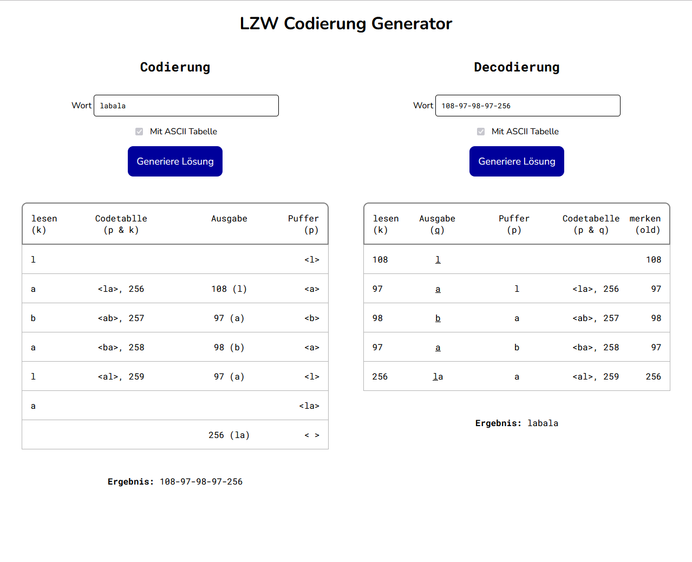

# LZW-Generator

Since my students asked me to give them more material to practice the LZW algorithm, I thought: why bother make a few practice sheets per hand, when I can code something that gives them unlimited solutions?  
Well, here we are...   

## ⚠️ What to be aware of
- the generating of the solution works only if you press the 'Generiere Lösung' button (doesn't work if you press enter)
- the generator is in German
- I don't provide the guarantee that the calculated results are right. 

## 🚀 How to run it 

1. download the repository to your local computer
2. open the index.html file in your browser
3. enjoy :)

## 👩‍💻 Author 
Annalisa Comin
